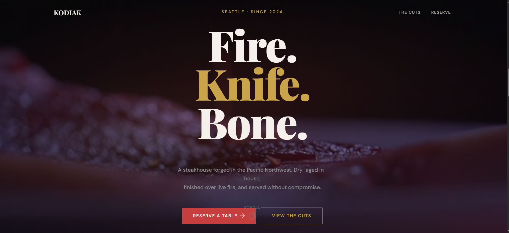

# KODIAK — Steakhouse



<!--  -->

A premium steakhouse landing page built with Laravel, Tailwind CSS v4, and Livewire. KODIAK is a fictional Pacific Northwest steakhouse — dark, bold, and driven by a "Fire. Knife. Bone." ethos.

## Overview

KODIAK is a single-page marketing site for a high-end steakhouse in Seattle. It features a cinematic hero with a fullscreen video reveal, a dry-aging statistics bar, a full menu grid, and a reservations section with contact details and hours.

## Features

- **Cinematic Hero Section** — Fullscreen background video with a clip-path reveal that expands on scroll. Dynamic parallax and scale transforms create a layered depth effect.
- **Scroll-Driven Animations** — CSS `clip-path` polygon animation on the hero video, fade/slide reveal on content blocks via `IntersectionObserver`, and count-up animation on stat numbers.
- **Menu Grid** — Single responsive 2-column grid for all menu items (steaks, sides, drinks) with equal vertical spacing using `gap-y-20`.
- **Accessibility** — Keyboard focus-visible outlines, `prefers-reduced-motion` media query support, semantic `aria-label` attributes on nav links.
- **Dark Theme** — Custom color palette (ember, surface, gold, crimson, warm, muted, edge) defined in Tailwind's `@theme` directive.

## Tech Stack

| Technology | Purpose |
|---|---|
| **Laravel** | Backend & Blade templating |
| **Tailwind CSS v4** | Utility-first styling |
| **Google Fonts** | Playfair Display + DM Sans |
| **Vite** | Asset bundling |

## Page Sections

1. **Hero** — Fullscreen video with animated clip-path reveal, headline, and CTA buttons.
2. **Stats** — Count-up metrics (10-year aged cheddar, 60-day dry-age, 1800° fire temp, 32oz Tomahawk).
3. **The Cuts** — Menu grid with 14 items across steaks, sides, and drinks. Each item shows name, price, and description.
4. **Reserve** — Location, hours, phone, and reservation CTA. Private dining and corkage info sidebar.
5. **Footer** — Brand mark, tagline, copyright.

## Local Development

```bash
composer install
npm install
npm run dev
```

Visit the page at the route serving `steakhouse.blade.php`.

## Assets

- Video: `/video/Steak.mp4`
- Styles: `resources/css/app.css` (imports `resources/css/style.css`)
- Screenshot: `./screenshot.png`
